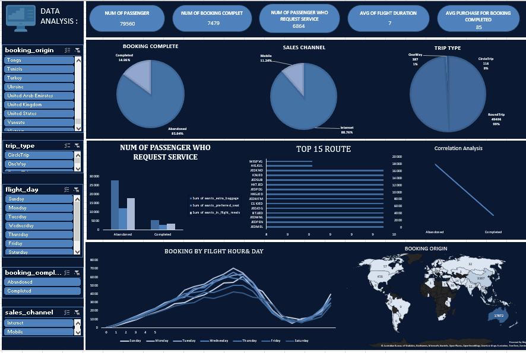

## 📌 Project Overview
This project focuses on analyzing flight booking data to discover customer behavior, booking trends, sales channel performance, and factors affecting completed and abandoned bookings.

The dashboard provides interactive insights to help understand passenger requests, booking patterns, and route performance.

---

## 📊 Dashboard Preview

---

## 🎯 Objectives
- Analyze passenger booking behavior
- Understand completed vs abandoned bookings
- Identify the most requested passenger services
- Analyze sales channels performance
- Discover top flight routes
- Explore booking trends by day and hour

---

## 🛠 Tools Used
- Microsoft Excel
- Data Cleaning
- Pivot Tables
- Charts & Dashboard Design
- Data Visualization

---

## 📈 Key Insights

- Total passengers analyzed: **79,560**
- Completed bookings: **7,479**
- Most passengers requested additional services
- Internet channel represents the highest sales contribution
- Booking activity changes depending on flight day and hour
- Top routes were identified based on passenger volume
- Booking origin distribution was analyzed globally

